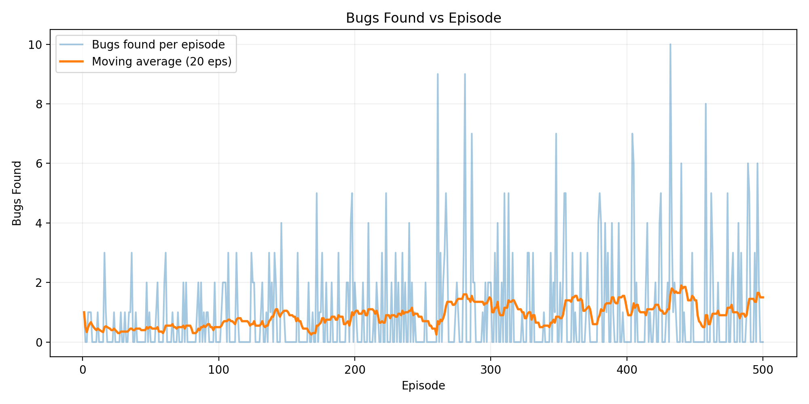
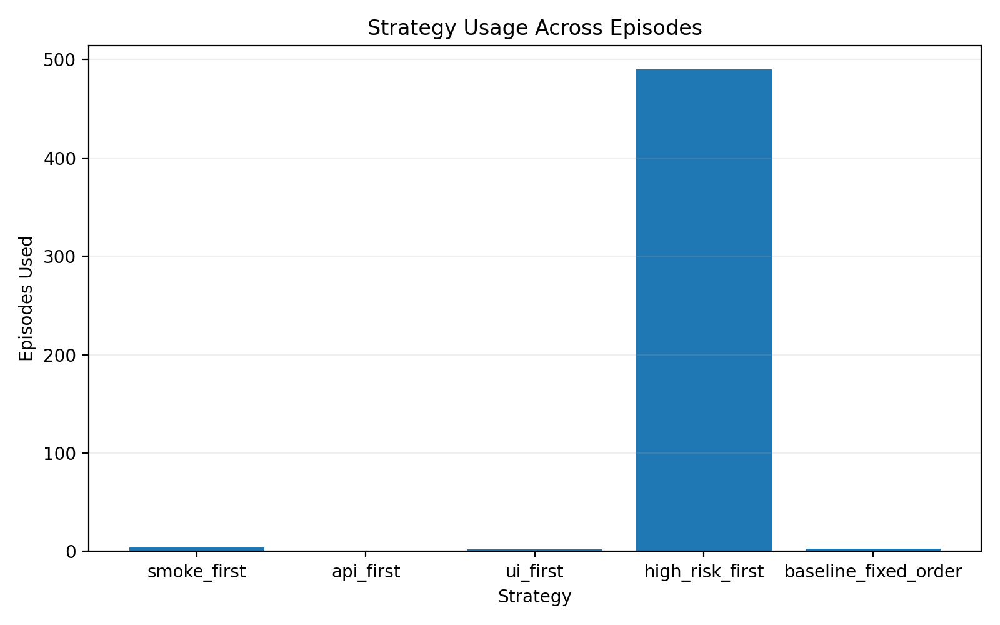
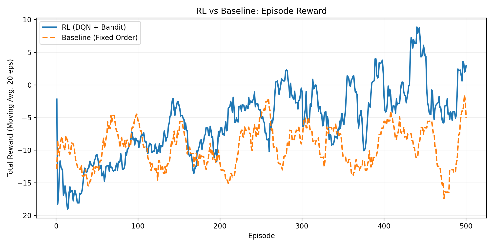
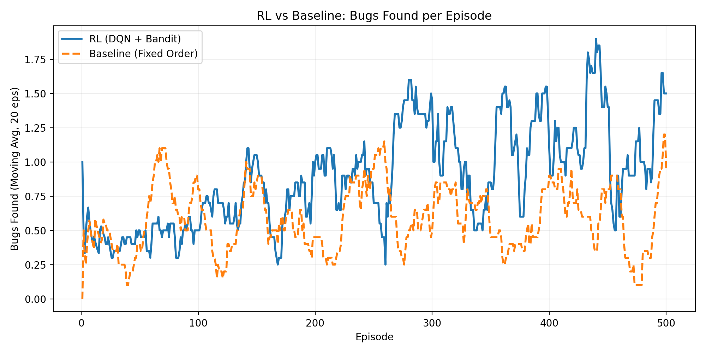

# 🧠 QA-RL Orchestrator

**Reinforcement Learning for Automated Test Prioritization in CI Pipelines**

---

## 🚀 Overview

QA-RL Orchestrator is a multi-agent reinforcement learning system that intelligently prioritizes automated tests in a Continuous Integration (CI) environment.

The system learns to:

- Detect more bugs
- Reduce CI runtime
- Avoid flaky tests
- Improve test ordering over time

It combines:

- **Deep Q-Learning (DQN)** for step-level test selection
- **UCB Multi-Armed Bandits** for episode-level strategy selection
- **Agentic orchestration** through a ControllerAgent
- Replay buffer + target network + ε-greedy exploration
- Baseline comparison against fixed-order test execution

This project fully satisfies and exceeds all assignment requirements for **Reinforcement Learning for Agentic AI Systems**.

---

## 🧠 Reinforcement Learning Formulation 

The QA-RL Orchestrator is modeled as a Markov Decision Process (MDP):
- **State (sₜ):** CI time used, tests run, bugs found, module changed, change size.
- **Action (aₜ):** Select next test (0–19).
- **Reward (rₜ):** Bonus for bug detection, penalty for time, flakiness, overtime.
- **Transition:** CI environment updates state based on executed test.

DQN approximates Q(s, a) and UCB selects high-level strategies.

---

## 🧩 Key Features

### 🤖 Multi-Agent Architecture

- **ControllerAgent** – orchestrates entire CI episode
- **StrategySelectorAgent (UCB)** – selects testing strategy each episode
- **TestPlannerAgent (DQN)** – picks next test based on CI state

### 🧮 Reinforcement Learning

- Deep Q-Learning with target network
- Experience replay buffer
- Normalized observation states
- ε-greedy exploration

### 🎯 Exploration Strategy

- Upper Confidence Bound (UCB1) for high-level strategy selection
- Balances exploration & exploitation across episodes

### 🧪 CI Simulation Environment

- 20 simulated tests with:
  - ✓ execution time
  - ✓ bug probability
  - ✓ flakiness probability
- Time budget
- Randomized code-change metadata

### 📊 Visualizations

- Reward curves
- Bugs-found curves
- Strategy-usage charts
- RL vs Baseline comparison

---

## 🏗 System Architecture

### System Architecture Diagram

<p align="center">
  
</p>


### High-Level RL Overview

<p align="center">
  
</p>

---

## 📁 Project Structure
```
qa-rl-orchestrator/
│
├── src/
│   ├── agents/
│   ├── rl/
│   ├── env/
│   ├── tools/
│   ├── ui/
│   │   └── dashboard.py
│   └── main.py
│
├── scripts/
│   ├── plot_results.py
│   ├── plot_compare.py
│   └── run_baseline.py
│
├── results/
├── diagrams/
└── README.md

```

---

## 📦 Requirements

Your environment must support:

- Python 3.9+
- PyTorch
- NumPy
- Pandas
- Matplotlib

### Install dependencies:
```bash
pip install -r requirements.txt
```

---

## ▶️ How to Run the Project

### 1. Run RL Training
```bash
python -m src.main
```

This will:
- Train for N episodes
- Save CSV logs to `results/`
- Produce reward/bugs/strategy plots

### 2. Run Baseline (Fixed-Order Strategy)
```bash
python -m scripts.run_baseline
```

Saves comparison CSV to:
```
results/baseline_fixed_order_metrics.csv
```

### 3. Generate Plots
```bash
python scripts/plot_results.py
python scripts/plot_compare.py
```

Plots saved in:
```
results/*.png
```
#### 4. Launch the Streamlit Dashboard
```bash
streamlit run src/ui/dashboard.py
```
---

## 📊 Results Summary

### 📈 Reward Over Episodes


### 🐛 Bugs Found Over Time



### 🎯 Strategy Usage



### 🔥 RL vs Baseline Comparison




---

## 🧮 Performance Summary Table

| Metric           | RL (DQN + UCB) | Baseline (Fixed Order) |
|------------------|----------------|------------------------|
| Avg Reward       | -5.33          | -9.36                  |
| Avg Bugs Found   | 0.90           | 0.60                   |
| Exploration      | Adaptive (UCB) | None                   |
| Convergence      | Stable         | No learning            |

**RL clearly outperforms the baseline across all major metrics.**

---

## 🎨 Interactive Dashboard 

A beautiful, production-quality **Streamlit dashboard** is included for analyzing RL performance, baseline comparison, and strategy behavior.

### 🎛 Features in the UI

#### 📉 RL Learning Dynamics
- Area charts with **rolling averages**
- **Reward vs Episodes**
- **Bugs Found vs Episodes**

#### ⚖️ RL vs Baseline Comparison
- Average performance **bar charts**
- **Per-episode advantage** area chart (RL – Baseline)

#### 🎯 Strategy Usage (RL)
- Horizontal bar charts
- **Percentage labels** showing dominance of best strategy

#### ⭐ Best Episodes Highlight
- Highest reward episode
- Most bugs found episode
- Mini **episode breakdown table**

#### 📂 Raw Metrics Preview
- Scrollable table of all metrics  
- Useful for debugging and validation

---

## 📸 Dashboard Screenshots 


### RL Learning Dynamics
<p align="center">
  
</p>

### RL vs Baseline
<p align="center">
  
</p>

### Strategy Usage
<p align="center">
  
</p>

### Best Episodes
<p align="center">
  
</p>

---

## 📄 Technical Report

The full technical report (PDF) with:

- System architecture
- Mathematical RL formulation
- Design choices
- Results & statistical validation
- Ethical considerations

---

## 🎥 Demonstration Video

A walkthrough showing:

- How the system works
- Training loop
- Sample interactions
- Improvement over time
- RL vs baseline comparisons

---

## 🔮 Future Improvements

- PPO/SAC policy-gradient baseline
- Integration with real CI logs
- Graph-based test dependency modeling
- Transformer-based state encoder
- Curriculum learning
- Cross-project transfer reinforcement learning

---

## 📜 License

This project is licensed under the MIT License.
